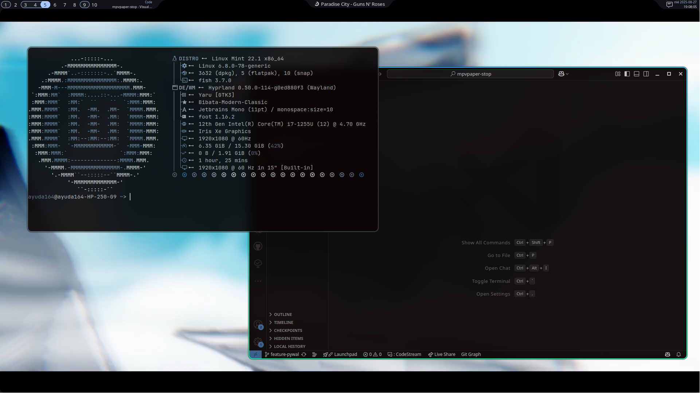
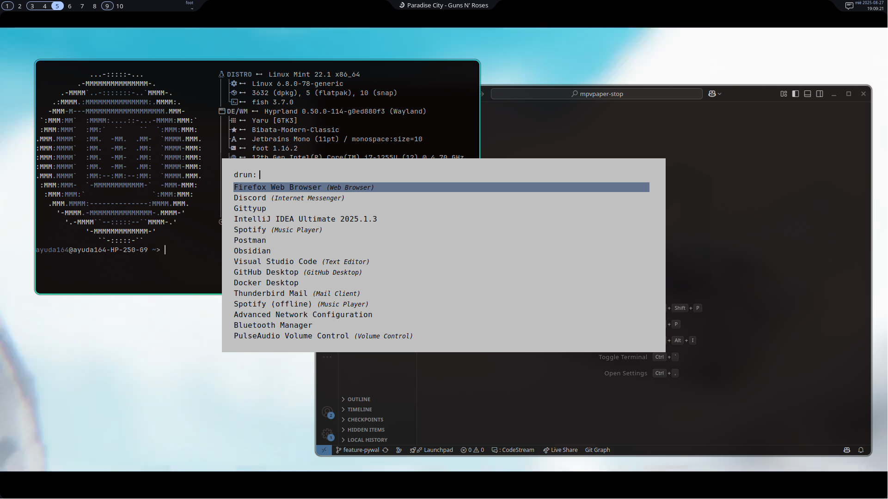

### dotfiles
My personal dotfiles - use at your own risk

This is my personal config for productivity and work. Most files are cherry-picked from other repos or created by reading docs. Don't expect anything incredible.

I use these dotfiles on both Linux Mint and Arch Linux. If you have trouble, it's a skill issue.

### Showcase

Images

  
_Lockscreen_

_Empty desktop_

_fastfetch + vscode pywal16 colored_

_rofi pywal16 colored_

Videos

https://github.com/user-attachments/assets/ae01c50e-aee5-47a1-b5e5-d42611060cd9

### Dependencies

#### Core
- **OS**: Linux Mint / Arch Linux
- **Window manager**: [Hyprland](https://github.com/hyprwm/Hyprland)
- **Font**: JetBrains Mono Nerd
- **Color generation**: [pywal16](https://github.com/eylles/pywal16)

#### Theming
- **GTK Theme**: [WhiteSur-gtk-theme](https://github.com/vinceliuice/WhiteSur-gtk-theme)
- **Icon Theme**: [WhiteSur-icon-theme](https://github.com/vinceliuice/WhiteSur-icon-theme)

#### Applications
- **Terminal**: [fish](https://github.com/fish-shell/fish-shell) + [kitty](https://github.com/kovidgoyal/kitty)
- **Launcher**: [rofi](https://github.com/davatorium/rofi)
- **Lock screen**: [swaylock](https://github.com/swaywm/swaylock)
- **Logout menu**: [wlogout](https://github.com/ArtsyMacaw/wlogout)
- **Upper bar**: [waybar-cava](https://aur.archlinux.org/packages/waybar-cava)
- **Animated wallpaper**: [mpvpaper](https://github.com/GhostNaN/mpvpaper)
- **Animated dynamic color generation**: [mpvpaper-stop](https://github.com/pvtoari/mpvpaper-stop)
- **Screenshots and video recording**: [grim](https://github.com/emersion/grim) + [slurp](https://github.com/emersion/slurp) + [wl-clipboard](https://github.com/bugaevc/wl-clipboard) + [wf-recorder](https://github.com/ammen99/wf-recorder)

### Special Thanks
- [kotontrion](https://github.com/kotontrion) - for the old ags config and README format inspiration
- [OriginCode](https://github.com/OriginCode) - for the waybar config inspiration
- [end-4](https://github.com/end-4) - for continuous work on dotfiles and window rules config that inspired my minimal approach
